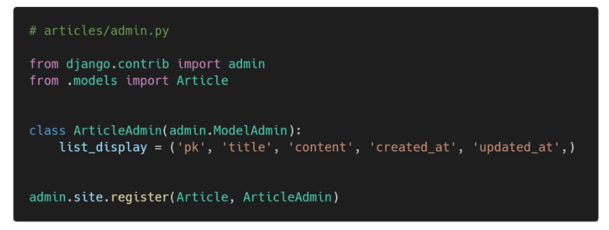

# Django2


## Model


#### Model

- 단일한 데이터에 대한 정보를 가짐
  - 사용자가 저장하는 데이터들의 필수적인 필드들과 동작들을 포함
- 저장된 데이터베이스의 구조(layout)
- Django는 model을 통해 데이터에 접속하고 관리
- 일반적으로 각각의 model은 하나의 데이터베이스 테이블에 매핑 됨


#### Database

- 데이터베이스(DB)
  - 체계화된 데이터의 모임
- 쿼리(Query)
  - 데이터를 조회하기 위한 명령어
  - 조건에 맞는 데이터를 추출하거나 조작하는 명령어
  - "Query를 날린다" > DB를 조작한다.


#### Database의 기본 구조

- 스키마(Schema)
  - 데이터베이스에서 자료의 구조, 표현방법, 관계 등을 정의한 구조 (structure)
  - 데이터베이스에서 구조와 제약 조건(자료의 구조, 표현 방법, 관계)에 관련한 전반적인 명세를 기술한 것.
- 테이블(Table)
  - 열(컬럼/필드)과 행(레코드/값)의 모델을 사용해 조직된 데이터 요소들의 집합. SQL 데이터베이스에서는 테이블을 관계 라고도 한다.
  - 열(column) 
    - 필드(field) or속성, 각 열에는 고유한 데이터 형식이 지정된다. INT TEXT NULL 등
  - 행(row) 
    - 필드(field) or튜플, 테이블의 데이터는 행에 저장된다. 즉, user 테이블에 4명의 고객정보가 저장되어 있으며, 행은 4개가 존재한다.
  - PK(기본키) 
    - 각 행(레코드)의 고유값으로 Primary Key로 불린다. 반드시 설정해야 하며, 데이터베이스 관리 및 관계 설정시 주요하게 활용된다.

> 


#### Model 정리

- 웹 애플리케이션의 데이터를 구조화하고 조작하기 위한 도구


## ORM

#### ORM

- Object-Relational-Mapping
- 객체 지향 프로그래밍 언어를 사용하여 호환되지 않는 유형의 시스템 간에(Django-SQL)데이터를 변환하는 프로그래밍 기술
- OOP 프로그래밍에서 RDBMS을 연동할 때, 데이터베이스와 객체 지향 프로그래밍 언어 간의 호환되지 않는 데이터를 변환하는 프로그래밍 기법
- Django는 내장 Django ORM을 사용함

> 


#### ORM의 장점과 단점

- 장점
  - SQL을 잘 알지 못해도 DB 조작이 가능
  - SQL의 절차적 접근이 아닌 객체 지향적 접근으로 인한 높은 생산성
- 단점
  - ORM 만으로 완전한 서비스를 구현하기 어려운 경우가 있음
- 현대 웹 프레임워크의 요점은 웹 개발의 속도를 높이는 것 (생산성)


#### 우리는 DB를 객체(object)로 조작하기 위해 ORM을 사용한다.


#### models.py 작성


- 각 모델은 django.models.Model 클래스의 서브 클래스로 표현됨
  - django.db.models 모듈의 Model 클래스를 상속받음
- models 모듈을 통해 어떠한 타입의 DB 컬럼을 정의할 것인지 정의
  - title과 content은 모델의 필드를 나타냄
  - 각 필드는 클래스 속성으로 지정되어 있으며, 각 속성은 각 데이터베이스의 열에 매핑


 #### 사용 모델 필드

- CharField(max_length=None, **options)
  - 길이의 제한이 있는 문자열을 넣을 때 사용
  - CharField의 max_length는 필수 인자
  - 필드의 최대 길이(문자), 데이터베이스 레벨과 Django의 유효성 검사(값을 검증하는 것)에서 활용
- TextField(**options)
  - 글자의 수가 많을 때 사용
  - max_length 옵션 작성시 자동 양식 필드인 textarea 위젯에 반영은 되지만 모델과 데이터베이스 수준에는 적용되지 않음
    - max_length 사용은 CharField에서 사용해야 함


## Migration

#### Migrations

- Django가 model에 생긴 변화를 반영하는 방법
- Migration 실행 및 DB 스키마를 다루기 위한 몇가지 명령어
  - makemigration
  - migrate
  - sqlmigrate
  - showmigrations


#### Migrations Commands

1. makemigrations
   - model을 변경한 것에 기반한 새로운 마이그레이션(like 설계도)을 만들 때 사용
2. migrate
   - 마이그레이션을 DB에 반영하기 위해 사용
   - 설계도를 실제 DB에 반영하는 과정
   - 모델에서의 변경 사항들과 DB의 스키마가 동기화를 이룸
3. sqlmigrate
   - 마이그레이션에 대한 SQL 구문을 보기 위해 사용
   - 마이그레이션이 SQL 문으로 어떻게 해석되어서 동작할지 미리 확인할 수 있음
4. showmigrations
   - 프로젝트 전체의 마이그레이션 상태를 확인하기 위해 사용
   - 마이그레이션 파일들이 migrate 됐는지 안됐는지 여부를 확인할 수 있음


#### Mirgrations

```bash
python manage.py makemigrations
# 'migrations/0001_initial.py' 생성 확인
```

```bash
python manage.py migrate

#0001_initila.py 설계도를 실제 DB에 반영
#db.sqlite3 우클릭 open database
```

```bash
#확인
python manage.py sqlmigrate 앱 이름 0001
# 해당 migrations 설계도가 SQL 문으로 어떻게 해석되어서 동작할지 미리 확인할 수 있음
```

```bash
#확인
python manage.py showmigrations
# migrations 설계도들이 migrate 됐는지 안됐는지 여부를 확인할 수 있음
```

```bash
#models.py 수정 (예시)

class Article(models.Model):
    
    title = models.CharField(max_length=30)
    content = models.TextField()
    created_at = models.DateTimeField(auto_now_add=True) #최초 생성
    updated_at = models.DateTimeField(auto_now=True) #최종 수정

```


#### model 수정

> 추가 모델 필드 작성 후 makemigrations 진행
>
> > 
>
> created_at 필드에 대한 default 값 설정 => 1 입력 후 enter
>
> > 
>
> timezone.now 함수 값 자동 설정
>
> => 빈 값 상태에서 enter 클릭
>
> => migrate를 통해 models.py 수정사항 반영
>
> > 


#### DateField's options

- auto_now_add
  - 최초 생성 일자
  - Django ORM이 최초 insert(테이블에 데이터 입력)시에만 현재 날짜와 시간으로 갱신(테이블에 어떤 값을 최초로 넣을 때)
- auto_now
  - 최종 수정 일자
  - Django ORM이 save를 할 때마다 현재 날짜와 시간으로 갱신


#### migration 3단계

1. models.py
   - model 변경사항 발생 시
2. $ python manage.py makemigrations
   - migrations 파일 생성
3. $ python manage.py migrate
   - DB 반영 (모델과 DB의 동기화)


## Database API

#### DB API

- DB를 조작하기 위한 도구
- Django가 기본적으로 ORM을 제공함에 따른 것으로 DB를 편하게 조작할 수 있도록 도움
- Model을 만들면 Django는 객체들을 만들고 읽고 수정하고 지울 수 있는 database-abstract API를 자동으로 만듦
- database-abstract API 혹은 database-access API 라고도 함


> DB API 구문 - Making Queries
>
> 


- Manager :star:
  - Django 모델에 데이터베이스 query 작업이 제공되는 인터페이스
  - 기본적으로 모든 Django 모델 클래스에 objects라는 Manager를 추가
- QuerySet :star:
  - 데이터베이스로부터 전달받은 객체 목록
  - queryset 안의 객체는 0개, 1개 혹은 여러 개일 수 있음
  - 데이터베이스로부터 조회, 필터, 정렬 등을 수행할 수 있음


#### Django shell

- 일반 Python shell을 통해서는 장고 프로젝트 환경에 접근할 수 없음
- 그래서 장고 프로젝트 설정이 load 된 python shell을 활용해 DB API 구문 테스트 진행
- 기본 Django shell보다 더 많은 기능을 제공하는 shell_plus를 사용해서 진행

```bash
# 라이브러리 설치
pip install ipython
pip install django-extensions

# 라이브러리 등록: settings.py > INSTALLED_APPS = [..., 'django_extensions', ...] 
```

```bash
# 실행
python manage.py shell_plus
```


## CRUD

- 대부분의 컴퓨터 소프트웨어가 가지는 기본적인 데이터 처리 기능인 Create(생성), Read(읽기), Update(갱신), Delete(삭제)를 묶어서 이르는 말


#### CREATE

```shell
# 1
article = Article()
article.title = "first"
article.content = "django!"
article.save()

# article = Article(30,'제목','내용') # id, title, content 순으로 쓰면 생성 가능
```

```shell
# 2
article = Article(title='second', content='django!')
article.save()
```

```shell
# 3
Article.objects.create(title= 'third', content='django!')
```

```python
# str method
# models.py 수정 (예시)

class Article(models.Model):
    
    title = models.CharField(max_length=10)
    content = models.TextField()
    created_at = models.DateTimeField(auto_now_add=True)
    updated_at = models.DateTimeField(auto_now=True)
	
    def __str__(self):
        return self.title
```


#### CREATE 관련 메서드

- save() method
  - Saving objects
  - 객체를 데이터베이스에 저장함
  - 데이터 생성 시 save()를 호출하기 전에는 객체의 ID 값이 무엇인지 알 수 없음
    - ID 값은 Django가 아니라 DB에서 계산되기 때문
  - 단순히 모델을 인스턴스화 하는 것은 DB에 영향을 미치지 않기 때문에 반드시 save()가 필요


#### READ

- QuerySet API method를 사용해 다양한 조회를 하는 것이 중요
- QuerySet API method는 크게 두가지로 분류
  1. Methods that return new querysets
  2. Methods that do not return querysets


- all()
  - 현재 QuerySet의 복사본을 반환
- get()
  - 주어진 lookup 매개변수와 일치하는 객체를 반환
  - 객체를 찾을 수 없으면 DoesNotExist 예외를 발생시키고, 둘 이상의 객체를 찾으면 MultipleObjectsReturned 예외를 발생 시킴
  - 위와 같은 특징을 가지고 있기 때문에 primary key와 같이 고유(unique)성을 보장하는 조회에서 사용해야 함
- filter()
  - 주어진 lookup 매개변수와 일치하는 객체를 포함하는 새 QuerySet을 반환


```shell
# 나가기 : exit

# 전체 article 조회 (READ)
Article.objects.all()

# 매개변수와 일치하는 객체 반환 (하나만 반환 가능! 둘 이상이면 안됨.)
Article.objects.get(pk=1) #예시
Article.objects.get(content='django!') #예시

# 매개변수와 일치하는 객체를 포함한 새 QuerySet 반환 (둘 이상 가능)
Article.objects.filter(content='django!') #예시
```


#### UPDATE

```shell
# article 인스턴스 객체의 인스턴스 변수의 값을 변경 후 저장
article = Article.objects.get(pk=1)
article.title = '바꿀 제목'
article.content = '바꿀 내용'
article.save()
```


#### DELETE

- delete()
  - QuerySet의 모든 행에 대해 SQL 삭제 쿼리를 수행하고, 삭제된 객체 수와 객체 우형당 삭제 수가 포함된 딕셔너리를 반환

```shell
article = Article.objects.get(pk=1)
article.delete()
```


#### Field lookups

- 조회 시 특정 검색 조건을 지정
- QuerySet 메서드 filter(), exclude() 및 get()에 대한 키워드 인수로 지정됨


## Admin Site


#### Automatic admin interface

- 사용자가 아닌 서버의 관리자가 활용하기 위한 페이지
- Model class를 admin.py에 등록하고 관리
- django.contrib.auth 모듈에서 제공됨
- record 생성 여부 확인에 매우 유용하며, 직접 record를 삽입할 수도 있음


#### admin 생성

```bash
python manage.py createsuperuser
```

- 관리자 계정 생성 후 서버를 실행한 다음 '/admin'으로 가서 관리자 페이지 로그인
  - 계정만 만든 경우 Django 관리자 화면에서 아무것도 보이지 않음
- 내가 만든 Model을 보기 위해서는 admin.py에 작성하여 Django 서버에 등록
- auth에 관련된 기본 테이블이 생성되지 않으면 관리자 계정을 생성할 수 없음


#### admin 등록


- admin.py는 관리자 사이트에 Article 객체가 관리자 인터페이스를 가지고 있다는 것을 알려주는 것
- models.py에 정의한 __str\_\_의 형태로 객체가 표현됨


#### ModelAdmin options



- list_display
  - models.py 정의한 각각의 속성(컬럼)들의 값(레코드)을 admin 페이지에 출력하도록 설정


## CRUD with views


#### HTTP method

- GET
  - 특성 리소스를 가져오도록 요청할 때 사용
  - 반드시 데이터를 가져올 때만 사용해야 함
  - DB에 변화를 주지 않음
  - CRUD에서 R 역할을 담당

- POST
  - 서버로 데이터를 전송할 때 사용
  - 리소스를 생성/변경하기 위해 데이터를 HTTP body에 담아 전송
  - 서버에 변경사항을 만듦
  - CRUD에서 C/U/D 역할을 담당


#### 사이트 간 요청 위조 (Cross-site request forgery)

- 웹 애플리케이션 취약점 중 하나로 사용자가 자신의 의지와 무관하게 공격자가 의도한 행동을 하여 특정 웹페이지를 보안에 취약하게 하거나 수정, 삭제 등의 작업을 하게 만드는 공격 방법
- Django는 CSRF에 대항하여 middleware와 template tag를 제공
- CSRF라고도 함


#### CSRF 공격 방어

- Security Token 사용 방식 (CSRF Token)
  - 사용자의 데이터에 임의의 난수 값을 부여해, 매 요청마다 해당 난수 값을 포함시켜 전송 시키도록 함
  - 이후 서버에서 요청을 받을 때마다 전달된 token 값이 유효한지 검증
- 일반적으로 데이터 변경이 가능한 POST, PATCH, DELETE Method 등에 적용 (GET 제외)
- Django는 CSRF token 템플릿 태그를 제공


#### Middleware

- 공통 서비스 및 기능을 애플리케이션에 제공하는 소프트웨어
- 데이터 관리, 애플리케이션 서비스, 메시징, 인증 및 API 관리를 주로 미들웨어를 통해 처리
- 개발자들이 애플리케이션을 보다 효율적으로 구축할 수 있도록 지원하며, 애플리케이션, 데이터 및 사용자 사이를 연결하는 요소처럼 작동


## 마무리

- Model
  - 웹 애플리케이션의 데이터를 구조화하고 조작하기 위한 도구
- Database
  - 체계화 된 테이터의 모임(집합)
- Migrations
  - Django가 model에 생긴 변화(필드를 추가, 모델 삭제 등)를 반영하는 방법
- ORM
  - OOP 언어를 사용하여 데이터베이스와 OOP언어 간의 호환되지 않는 데이터를 변환하는 프로그래밍 기법
- Database API
  - DB를 조작하기 위한 도구 (QuerySet API, CRUD)
- Admin Site
  - 사용자가 아닌 서버의 관리자가 활용하기 위한 페이지